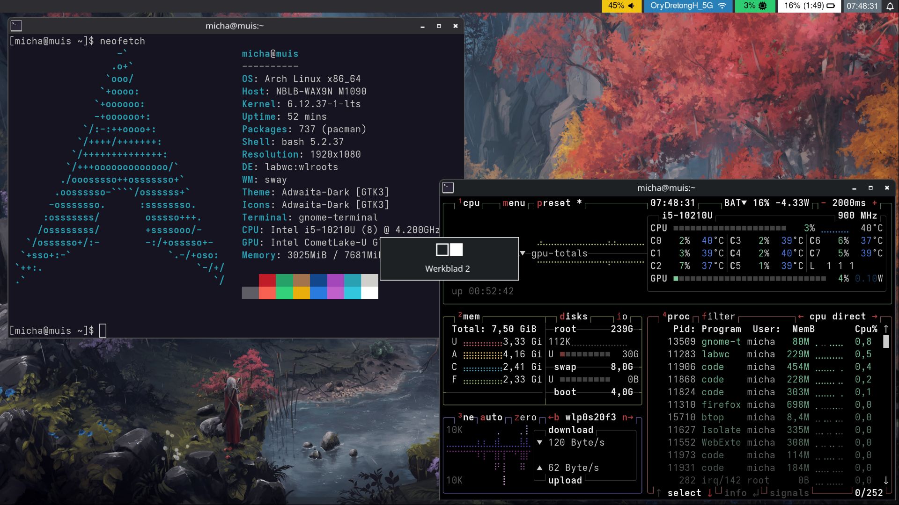
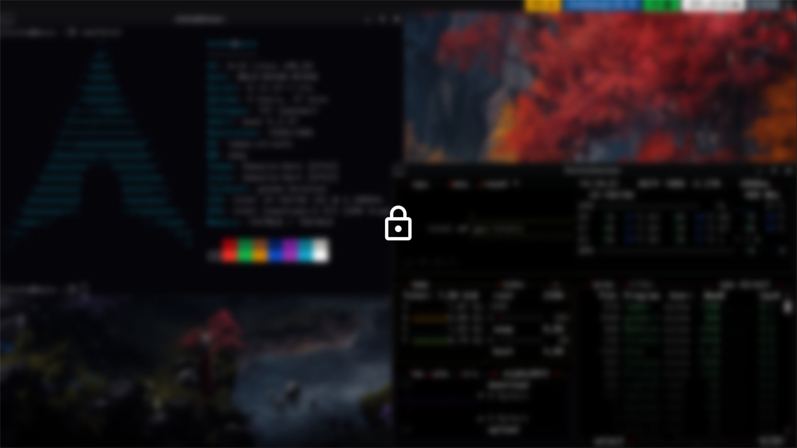

# (r)ice

uhhh, yea, some stuff, tiling happened to not really be my thing, so labwc it is ig  
shortcuts heavily inspired by a mix of ubuntu, chromeos and windows  
also, some virtual desktop management stuff is **very** hacky, but as long as it works, ey?

- WM: labwc
- Theme: Adwaita-Dark
- Terminal: gnome-terminal
- Files: nautilus
- Launcher: rofi
- Lockscreen: swaylock-fancy
- Notifications: swaync
- Status Bar: Waybar
- Emoji picker: rofi-emoji

# screenshots




# installation (arch)

```sh
sudo pacman -S kanshi labwc xorg-xhost xorg-xwayland swaybg xdg-desktop-portal-gtk adwaita-qt polkit-gnome wl-clip-persist rofi-wayland swaylock wlr-randr brightnessctl alsa-utils grim slurp wl-clipboard nautilus alacritty swayidle pipewire gnome-terminal cliphist swaync waybar otf-font-awesome xdg-desktop-portal xdg-desktop-portal-wlr qt6-wayland qt5-wayland rofi-emoji wtype pipewire-pulse pavucontrol ttf-nerd-fonts-symbols-mono
paru -S swaylock-fancy-git wlopm
mkdir ~/Screenshots/
gsettings set org.gnome.desktop.interface color-scheme 'prefer-dark'
```

# accidental PR(s) to make stuff work
[Support any WM implementing the wlr-output-management protocol #10](https://github.com/Big-B/swaylock-fancy/pull/10)
